<table>
  <tr>
    <td width="150">
      
    </td>
    <td>
      <h1>Aleksandr Gordeev</h1>
      <h3>Data Analyst | Business Analyst</h3>
      
Turning data into real business insights for making better decisions

    </td>
  </tr>
</table>

# 👨‍💼 About Me:

Business and Product Analyst with a diverse professional background and a proven track record of supporting product development and translating complex data into actionable insights that drive strategic decisions. Proficient at Python, PowerBI, SQL, LLM and Market Research. Seeking an Analyst Individual Contributor role to grow into business intelligence and product strategy positions where I can link technical analysis and executive decision-making.

**Tech Stack:** Python | Power BI | SQL | LLM | Market Research

# My Project Portfolio:

 

  
<b>📊 Loan Analysis Project (Power BI)</b>

   

  <h3>📌 Project Description</h3>
  

  This project on lending portfolio analysis demonstrates how raw financial and customer data can be translated into strategic insights using Power BI and DAX. 
  

  

  Research questions:
  

  <h3>🖥️ Dashboard Preview</h3>

    
    
    
  

  <h3>📊 Outcomes</h3>
  <ul>
    <li>Identified customer groups that drive growth through income band, loan purpose, and state, revealing the most profitable states and regions, and that          wedding loans' profit margin is 17.6% higher than overall.</li>
    <li>Analysed portfolio growth and profitability enablers, uncovering that grade-C loans has the best risk-adjusted return of 7.11% while only accountable for      27.9% of the portfolio, highlighting scalable opportunities for sustainable growth.</li>
    <li>Designed and deployed an interactive Power BI dashboard integrating Portfolio at Risk, Loan YoY growth, weighted interest rate, profitability KPIs and         various graphics, enabling data-driven risk control and strategic lending decisions.</li>
  </ul>

  
<b>✈️ British Airways Customer Review Analysis + Predictive Modelling (Python)</b>

   

  <h3>📌 Project Description</h3>
  

  This project consists of two analytical stages: sentiment analysis of customer reviews 
  and predictive modelling for booking completion.
  

  

  <b>Stage 1 – Sentiment Analysis:</b> 
  Customer review data was scraped from an online source using <b>BeautifulSoup (BS4)</b>. 
  The dataset was cleaned and preprocessed with <b>NLTK</b>, and sentiment analysis 
  was conducted using <b>VADER Sentiment</b> to classify reviews as 
  <i>Positive</i>, <i>Neutral</i>, or <i>Negative</i>. 
  This enabled the evaluation of the overall customer satisfaction distribution.
  

  

  <b>Stage 2 – Predictive Modelling:</b> 
  A <b>Random Forest Classification</b> model (sklearn) was deployed to predict 
  booking completion. With an accuracy of <b>85.44%</b>, the model identified 
  the most important factors influencing whether a customer completes a booking.
  

  <h3>🖥️ Sentiment Analysis Preview</h3>

  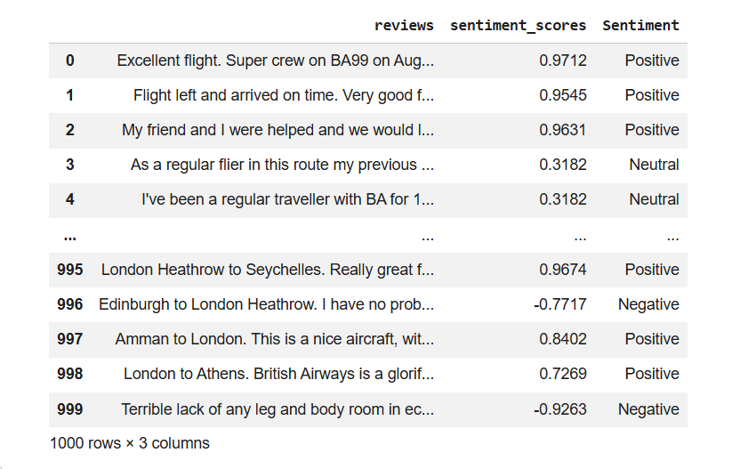  
  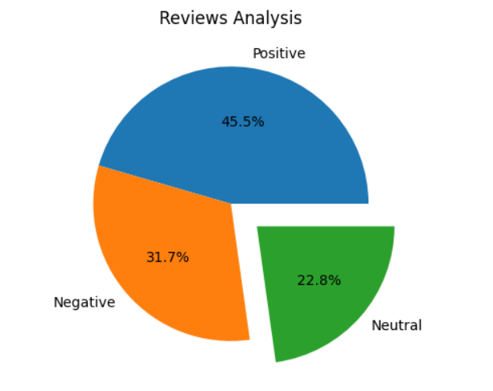

  <h3>📊 Predictive Model Insights</h3>

  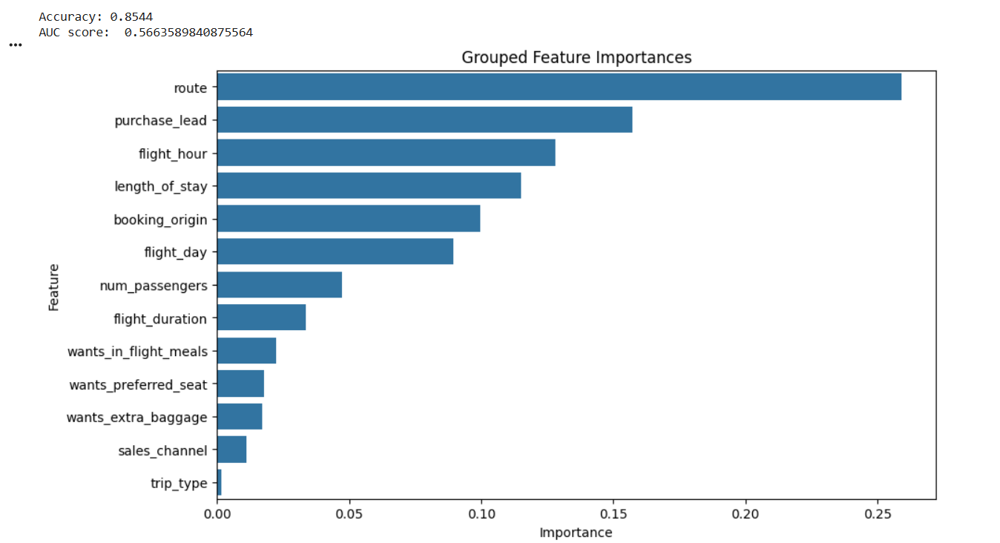

  <h3>📈 Outcomes</h3>
  <ul>
    <li>Scraped and cleaned third-party review data using <b>BS4</b> and <b>NLTK</b></li>
    <li>Conducted sentiment analysis using <b>VADER</b> to evaluate customer satisfaction trends</li>
    <li>Designed and fine-tuned a <b>Random Forest</b> classifier achieving <b>85.44% accuracy</b></li>
    <li>Identified key drivers impacting booking completion decisions</li>
    <li>Visualised insights for clear communication to non-technical stakeholders</li>
  </ul>

  <h3>🛠️ Tools & Technologies</h3>
  

  Python | BeautifulSoup (BS4) | NLTK | VADER Sentiment | Scikit-learn | 
  Pandas | Matplotlib
  

  
<b>💳 Credit Card Transactional Analysis & Fraud Detection (Python)</b>

   

  <h3>📌 Project Description</h3>

  

  This project analyses a large credit card transaction dataset containing over 
  <b>1.85 million records</b>, including transaction timestamps, amounts, merchant details,
  customer demographics, and geospatial information.
  

  

  The dataset was sourced from <b>Kaggle</b>, then cleaned and transformed using Python 
  for exploratory data analysis and fraud detection investigation.
  

  
<b>Main objectives:</b>

  <ul>
    <li>Identify customer segments and transaction behaviour trends to support product and marketing decisions.</li>
    <li>Analyse fraudulent transaction patterns and determine the main states and merchants associated with fraud.</li>
  </ul>

  <h3>👥 Customer Segmentation Analysis</h3>

  
<b>Customer segmentation by age group and spending behaviour:</b>

  <table>
    <tr>
      <td>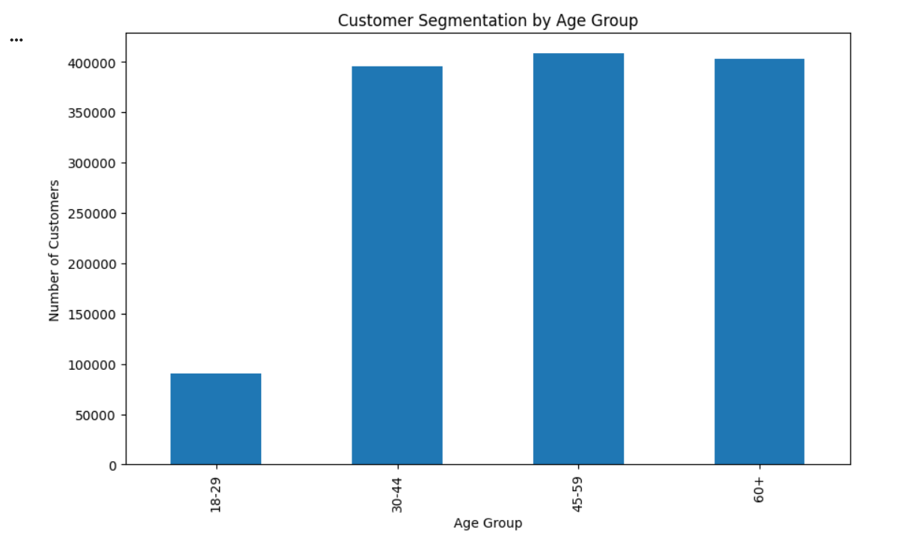</td>
      <td>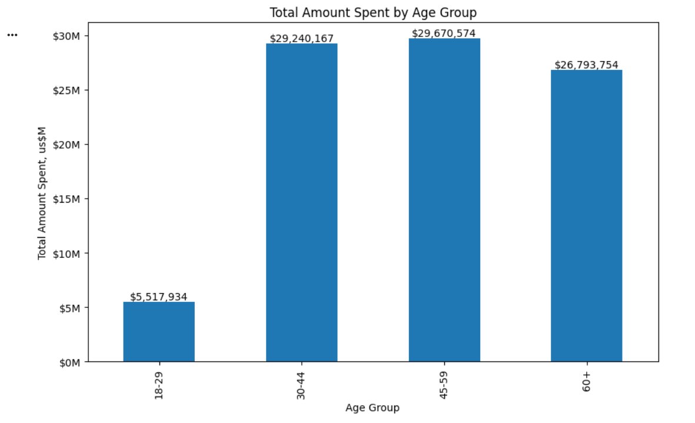</td>
    </tr>
  </table>

   

  
<b>Customer segmentation by purchase category:</b>

  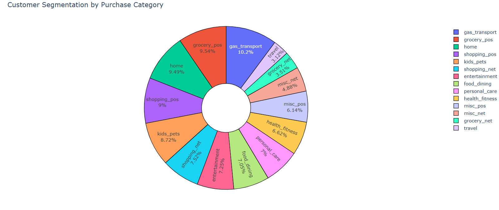

  <h3>💰 Transaction Spending Analysis</h3>

  
<b>Average transaction amount per purchase category:</b>

  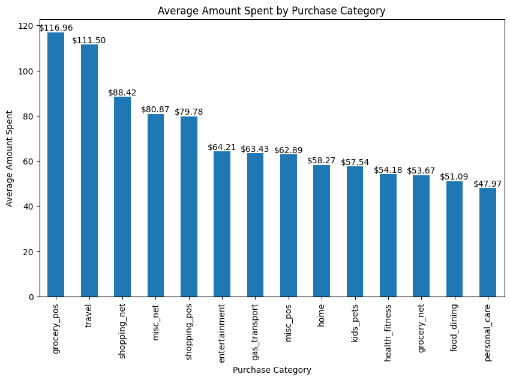

   

  
<b>Total spending by job title (Top-10) and job roles with the highest average transaction value:</b>

  <table>
    <tr>
      <td>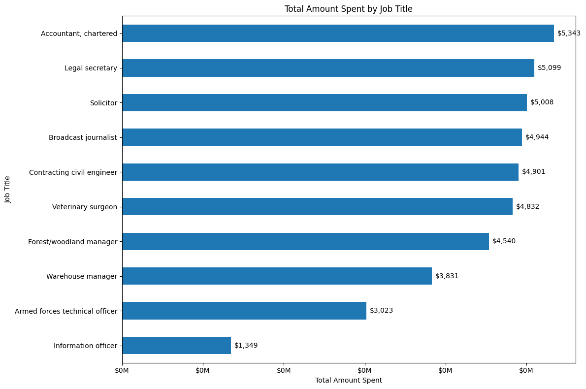</td>
      <td>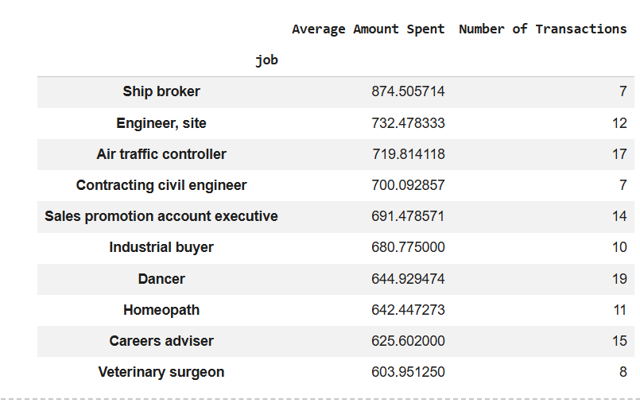</td>
    </tr>
  </table>

  <h3>🌍 Geospatial Transaction Analysis</h3>

  
<b>Transaction volume distribution by US state:</b>

  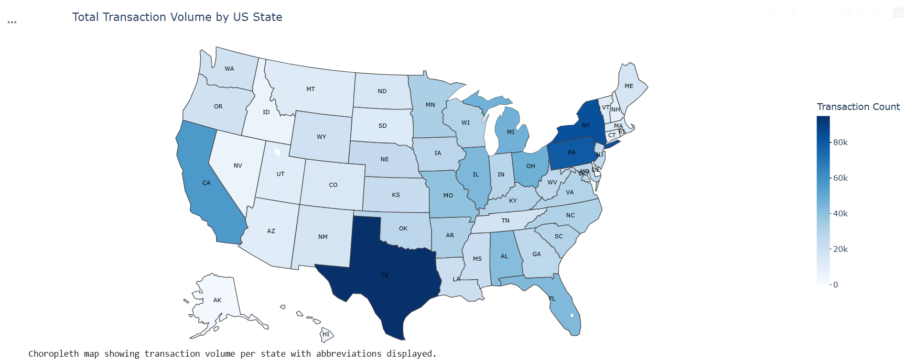

  <h3>🚨 Fraud Detection Analysis</h3>

  

  Fraudulent transaction activity was analysed geographically and across merchants 
  and customers to identify potential risk areas and suspicious behaviour patterns.
  

  
<b>Fraud transaction volume by location:</b>

  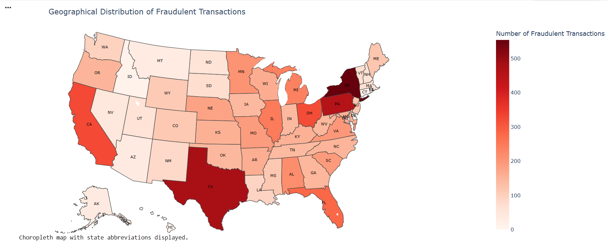

   

  
<b>Merchants and customers with the highest fraudulent transaction counts:</b>

  <table>
    <tr>
      <td>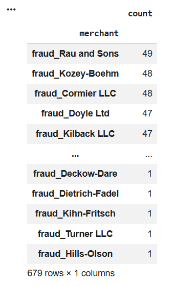</td>
      <td>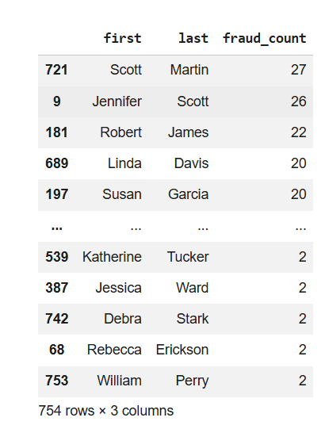</td>
    </tr>
  </table>

  <h3>📈 Outcomes</h3>

  <ul>
    <li>Identified business growth opportunities by delivering clear transaction insights and conducting a complex customer segmentation.</li>
    <li>Analysed transaction geographic distribution and mapped spending patterns along potential fraud risk regions and merchants.</li>
  </ul>

  <h3>🛠️ Tools & Technologies</h3>

  

  Python | Pandas | NumPy | Matplotlib | Seaborn | Geospatial Analysis | Data Visualisation
  

