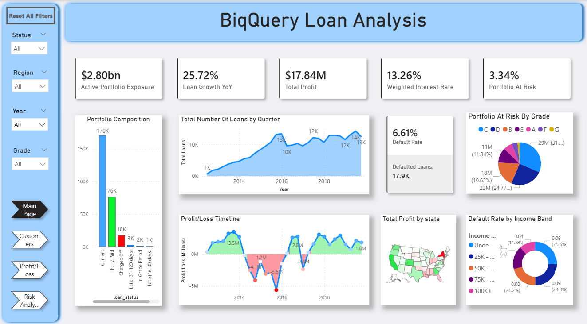
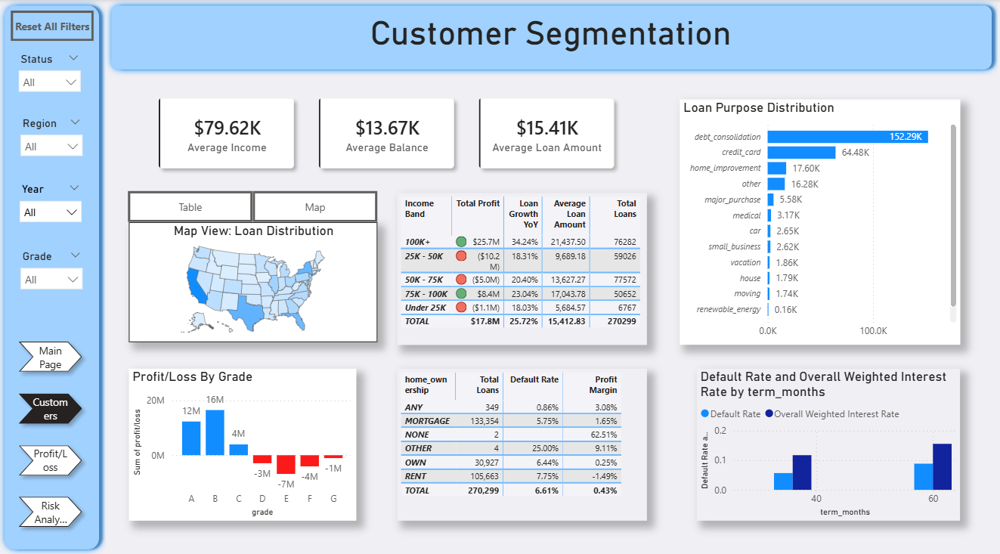
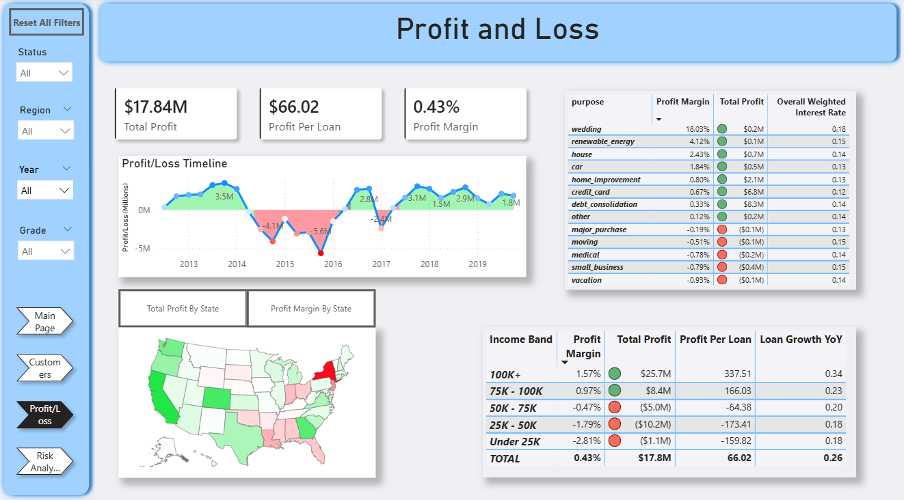

Turn Data Into Real Business Insights For Making Better Decisions
 
## About me: 
 
Business and Product Analyst with a diverse professional background and a proven track record of supporting product development and translating complex data into actionable insights that drive strategic decisions. Proficient at Python, PowerBI, SQL, LLM and Market Research. Seeking an Analyst Individual Contributor role to grow into business intelligence and product strategy positions where I can link technical analysis and executive decision-making.
< >
# My Project Portfolio:
   
# Loan Analysis Project /Power BI

 

Project Description:

 

Preview:

 

Outcomes:

 

 

 

 

