<table>
  <tr>
    <td width="150">
      
    </td>
    <td>
      <h3>Data Analyst | Business Analyst</h3>
      
Turning data into real business insights for making better decisions

    </td>
  </tr>
</table>

# 👨‍💼 About Me:

Data Analyst with a Distinction in MSc Business Analytics and strong foundation in market research and data-driven strategic decision-making.  
Experienced in ensuring high-quality data through data ETL, cleaning and preparation, conducting structured data analysis, and translating 
complex data into actionable insights through clear and compelling storytelling. 
Skilled in Python, Power BI, SQL and Advanced Excel with the ability to look at business needs from broader perspective and create strategic 
recommendations that drive growth.

**Tech Stack:** Python | Power BI | SQL | LLM | Machine Learning | Statistical Analysis & Hypothesis Testing | Market Research & Go-to-Market

## 🛠 Tech Stack

  

# My Project Portfolio:

 

  
<b>📊 Loan Analysis Project | Power BI, DAX</b>

   

  <h3>📌 Project Description</h3>
  

  Analysed a lending portfolio to identify growth opportunities and risk control improvements, delivering an interactive Power BI dashboard for strategic decision-making. 
  

  <h3>🖥️ Dashboard Preview</h3>

  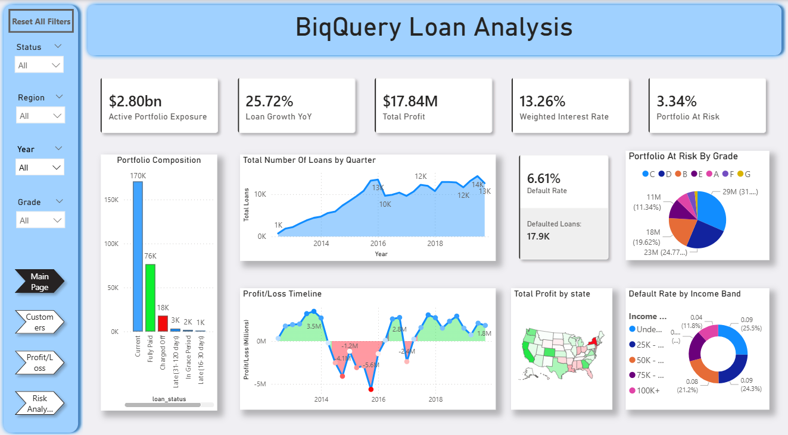  
  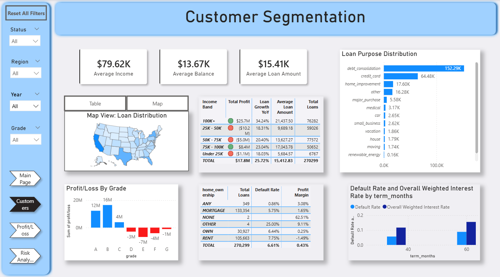  
  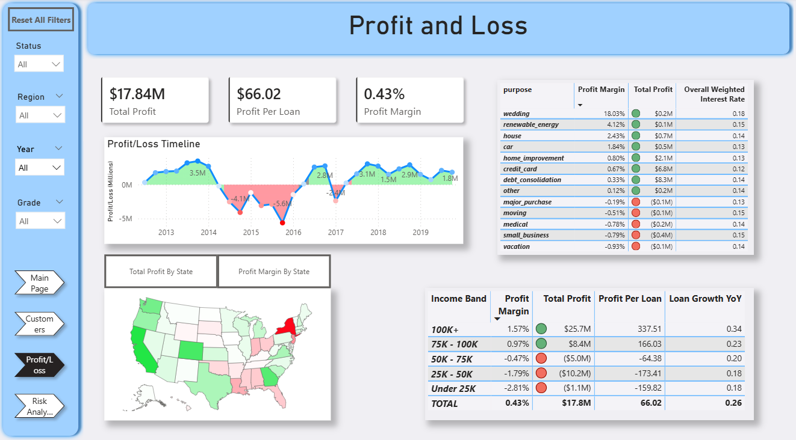  
  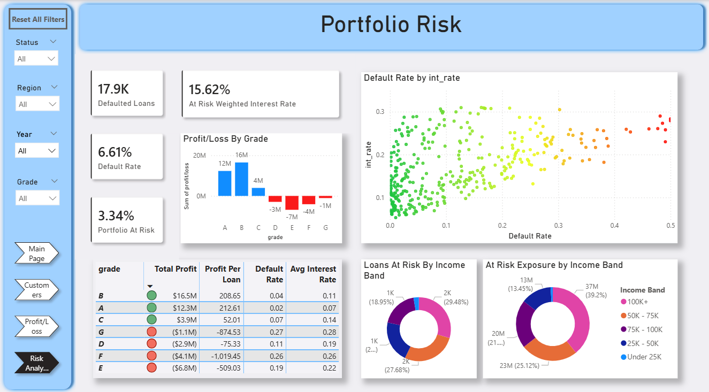

  <h3>📊 Outcomes</h3>
  <ul>
    <li>Identified customer groups that drive growth through income band, loan purpose, and state, revealing the most profitable states and regions, and that wedding loans' profit margin is 17.6% higher than overall.</li>
    <li>Uncovered grade-C loans as the best risk-adjusted return opportunity - delivering 7.11% return, while only accountable for 27.9% of the portfolio, highlighting scalable opportunities for sustainable growth.</li>
    <li>Designed and deployed an interactive Power BI dashboard integrating Portfolio at Risk, Loan YoY growth, weighted interest rate, profitability KPIs and various graphics, enabling data-driven risk control and strategic lending decisions.</li>
  </ul>

  
<b>✈️ British Airways Customer Review Analysis + Predictive Modelling | Python, Sentiment Analysis, Machine Learning</b>

   

  <h3>📌 Project Description</h3>
  

  End-to-end NLP and machine learning pipeline analysing British Airways customer reviews and predicting booking completion to support marketing and customer experience strategy.
  

  

  <b>Stage 1 – Sentiment Analysis:</b> 
  Customer review data was scraped from an online source using <b>BeautifulSoup (BS4)</b>. 
  The dataset was cleaned and preprocessed with <b>NLTK</b>, and sentiment analysis 
  was conducted using <b>VADER Sentiment</b> to classify reviews as 
  <i>Positive</i>, <i>Neutral</i>, or <i>Negative</i>. 
  This enabled the evaluation of the overall customer satisfaction distribution.
  

  

  <b>Stage 2 – Predictive Modelling:</b> 
  A <b>Random Forest Classification</b> model (sklearn) was deployed to predict 
  booking completion. With an accuracy of <b>85.44%</b>, the model identified 
  the most important factors influencing whether a customer completes a booking.
  

  <h3>🖥️ Sentiment Analysis Preview</h3>

  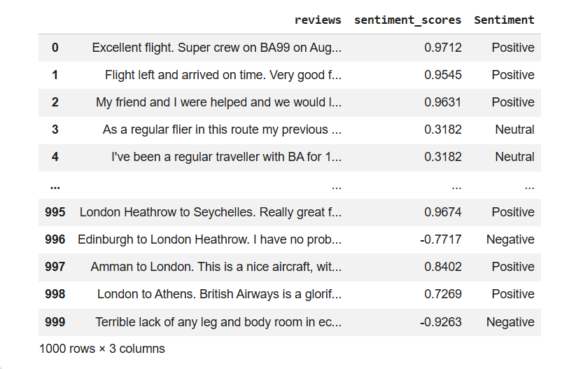  
  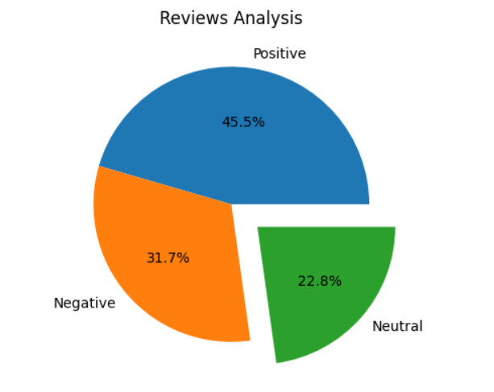

  <h3>📊 Predictive Model Insights</h3>

  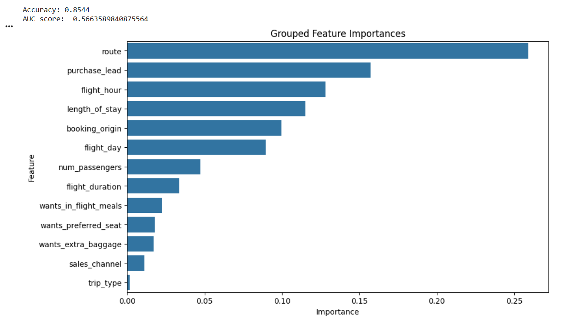

  <h3>📈 Outcomes</h3>
  <ul>
    <li>Scraped and processed third-party review data using BeautifulSoup and NLTK, conducting VADER sentiment analysis to map customer satisfaction distribution across Positive, Neutral, and Negative segments.</li>
    <li>Built and fine-tuned a Random Forest classifier, achieving 85.44% accuracy in predicting booking completion, identifying key behavioural drivers as destination, purchase lead and length of flight to inform targeted marketing decisions.</li>
    <li>Delivered visualised insights structured for non-technical stakeholder communication.</li>
  </ul>

  <h3>🛠️ Tools & Technologies</h3>
  

  Python | BeautifulSoup (BS4) | NLTK | VADER Sentiment | Scikit-learn | 
  Pandas | Matplotlib
  

  
<b>💳 Credit Card Transactional Analysis & Fraud Detection | Python</b>

   

  <h3>📌 Project Description</h3>

  

  This project analyses a large credit card transaction dataset containing over 
  <b>1.85 million records</b>, including transaction timestamps, amounts, merchant details,
  customer demographics, and geospatial information.
  

  

  The dataset was sourced from <b>Kaggle</b>, then cleaned and transformed using Python 
  for exploratory data analysis and fraud detection investigation.
  

  
<b>Main objectives:</b>

  <ul>
    <li>Identify customer segments and transaction behaviour trends to support product and marketing decisions.</li>
    <li>Analyse fraudulent transaction patterns and determine the main states and merchants associated with fraud.</li>
  </ul>

  <h3>👥 Customer Segmentation Analysis</h3>

  
<b>Customer segmentation by age group and spending behaviour:</b>

  <table>
    <tr>
      <td>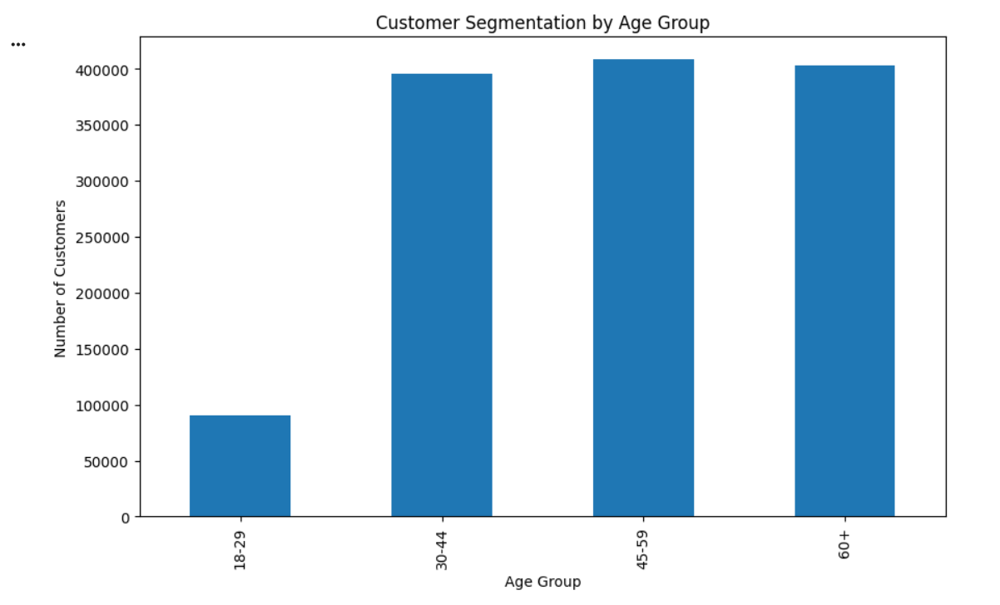</td>
      <td>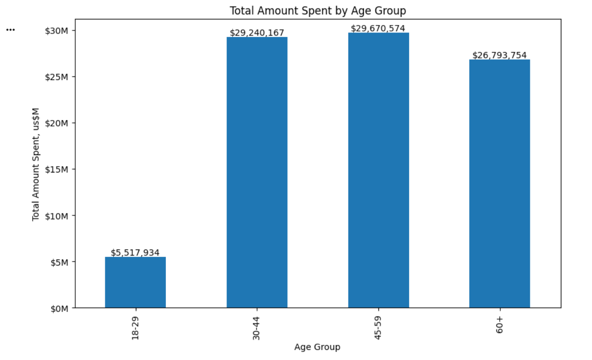</td>
    </tr>
  </table>

   

  
<b>Customer segmentation by purchase category:</b>

  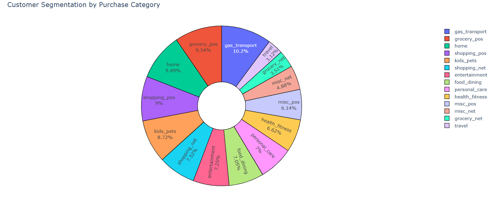

  <h3>💰 Transaction Spending Analysis</h3>

  
<b>Average transaction amount per purchase category:</b>

  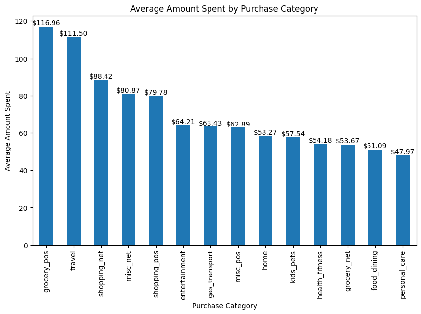

   

  
<b>Total spending by job title (Top-10) and job roles with the highest average transaction value:</b>

  <table>
    <tr>
      <td>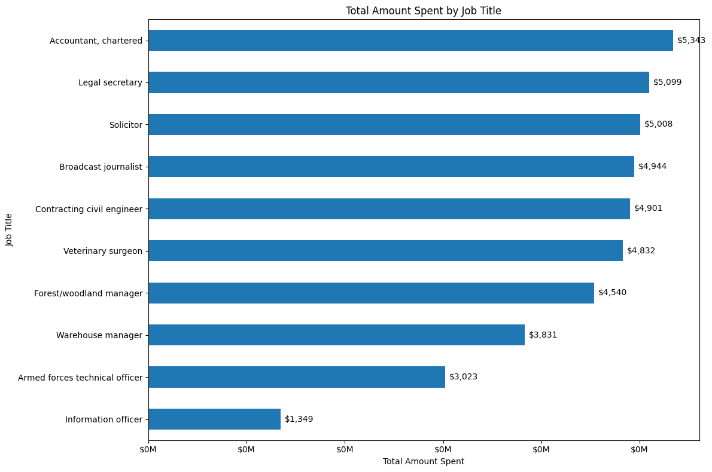</td>
      <td>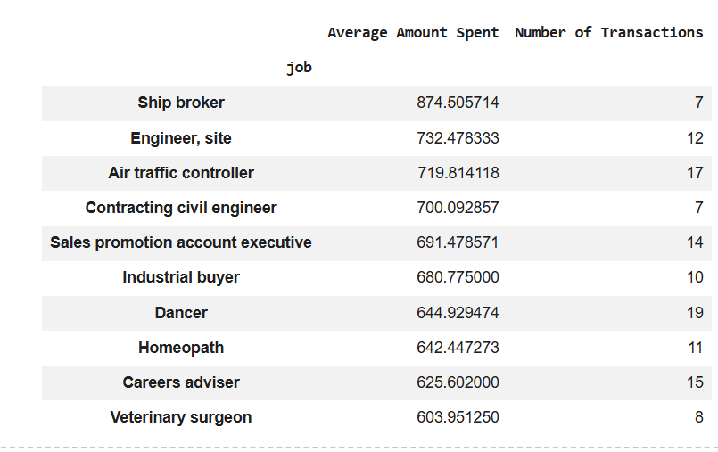</td>
    </tr>
  </table>

  <h3>🌍 Geospatial Transaction Analysis</h3>

  
<b>Transaction volume distribution by US state:</b>

  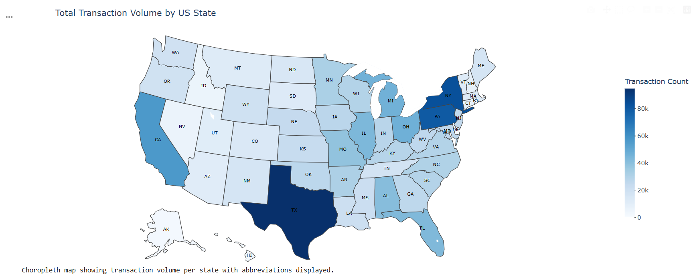

  <h3>🚨 Fraud Detection Analysis</h3>

  

  Fraudulent transaction activity was analysed geographically and across merchants 
  and customers to identify potential risk areas and suspicious behaviour patterns.
  

  
<b>Fraud transaction volume by location:</b>

  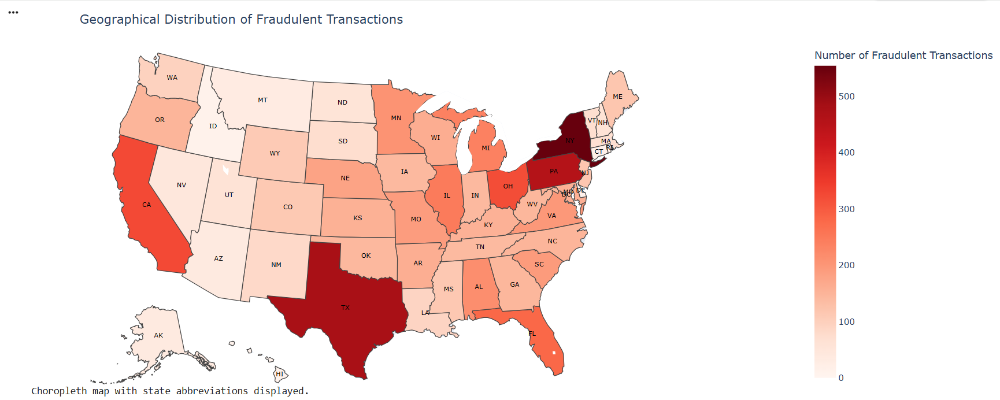

   

  
<b>Merchants and customers with the highest fraudulent transaction counts:</b>

  <table>
    <tr>
      <td>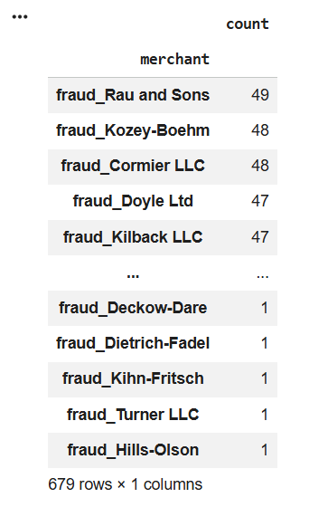</td>
      <td>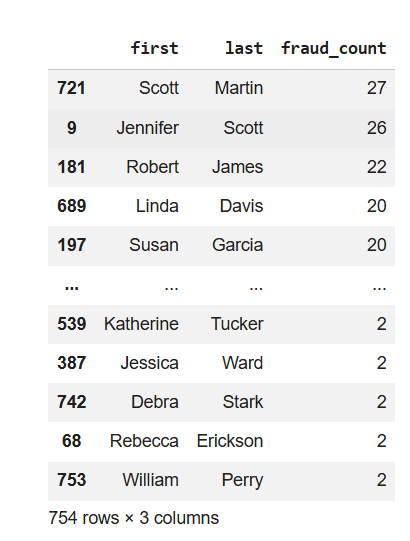</td>
    </tr>
  </table>

  <h3>📈 Outcomes</h3>

  <ul>
    <li>Identified business growth opportunities by delivering clear transaction insights and conducting a complex customer segmentation.</li>
    <li>Analysed transaction geographic distribution and mapped spending patterns along potential fraud risk regions and merchants.</li>
  </ul>

  <h3>🛠️ Tools & Technologies</h3>

  

  Python | Pandas | NumPy | Matplotlib | Seaborn | Geospatial Analysis | Data Visualisation
  

